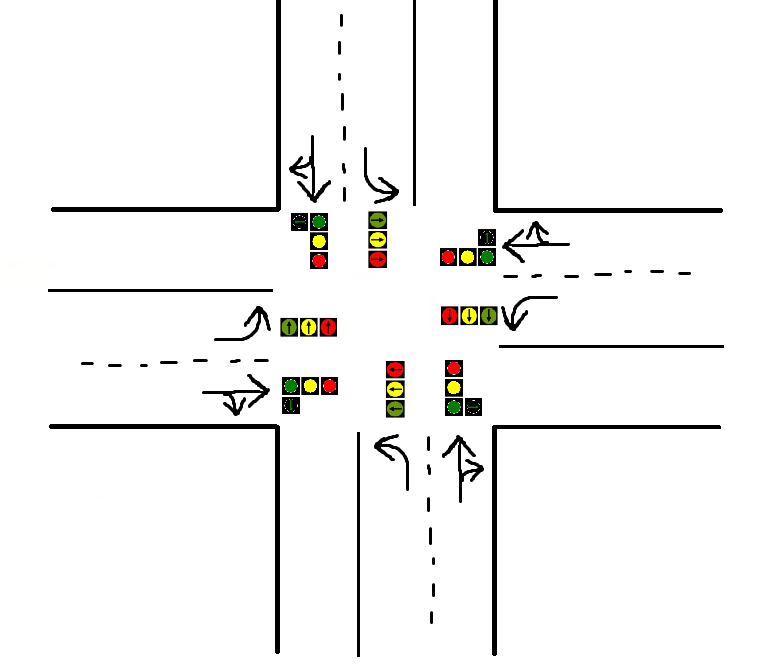
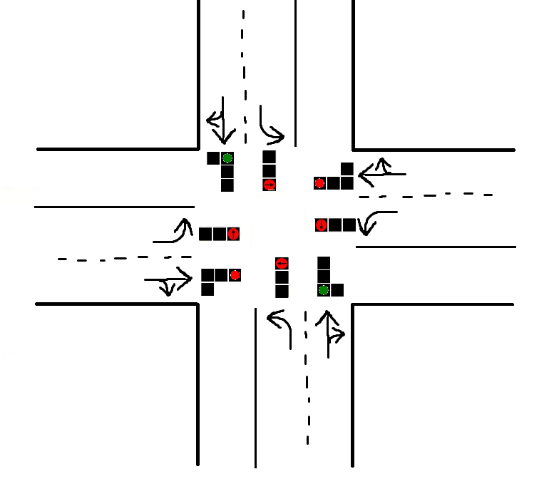
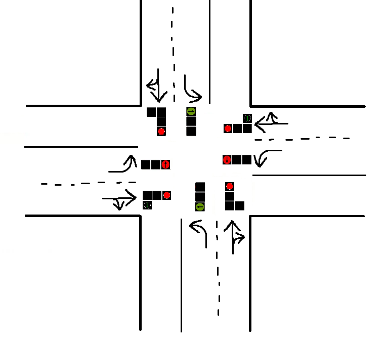
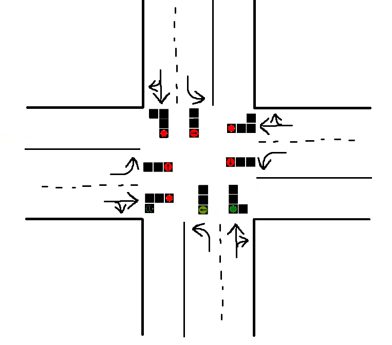

# TrafficLightsController

## Zadanie rekrutacyjne od AVSystems

Stwórz symulację inteligentnych świateł drogowych na skrzyżowaniu. Celem zadania jest zaprojektowanie i zaimplementowanie systemu, który dostosowuje cykle świateł w oparciu o natężenie ruchu na poszczególnych drogach.

Twój system powinien:

- Stanowić bliską rzeczywistości reprezentację skrzyżowania z czterema drogami dojazdowymi (północ, południe, wschód, zachód)

- Symulować standardowe cykle świateł drogowych (np. zielone, żółte, czerwone) oraz ewentualne dodatkowe fazy (np. zielone strzałki) na każdej drodze dojazdowej

- Zapewniać bezpieczeństwo poprzez unikanie sytuacji konfliktowych, takich jak np. zielone światło dla dwóch kolidujących kierunków

- Śledzić liczbę pojazdów oczekujących na każdej drodze dojazdowej

Opcjonalne rozszerzenia: różne tryby pracy świateł, kilka pasów na drogach dojazdowych, GUI, priorytetyzacja dróg, piesi, awarie itp.

Format przyjmowanych danych do symulacji: plik JSON z listą komend

```{
  "commands": [
    {
      "type": "addVehicle",
      "vehicleId": "vehicle1",
      "startRoad": "south",
      "endRoad": "north"
    },
    {
      "type": "addVehicle",
      "vehicleId": "vehicle2",
      "startRoad": "north",
      "endRoad": "south"
    },
    {
      "type": "step"
    },
    {
      "type": "step"
    },
    {
      "type": "addVehicle",
      "vehicleId": "vehicle3",
      "startRoad": "west",
      "endRoad": "south"
    },
    {
      "type": "addVehicle",
      "vehicleId": "vehicle4",
      "startRoad": "west",
      "endRoad": "south"
    },
    {
      "type": "step"
    },
    {
      "type": "step"
    }
  ]
}
```
- Komenda addVehicle: dodaje pojazd na wskazanej drodze początkowej (startRoad) z celem dojazdu do drogi końcowej (endRoad).

- Komenda step: wykonuje krok symulacji, podczas którego przez skrzyżowanie przejeżdżają pierwsze pojazdy na drodze, która aktualnie ma zielone światło.

Format wyjścia: plik JSON z listami ID pojazdów, które opuszczały skrzyżowanie w kolejnych krokach:

```
{
  "stepStatuses" : [ {
    "leftVehicles" : [ "vehicle2", "vehicle1" ]
  }, {
    "leftVehicles" : [ ]
  }, {
    "leftVehicles" : [ "vehicle3" ]
  }, {
    "leftVehicles" : [ "vehicle4" ]
  } ]
}
```

## Opis rozwiązania

Moje rozwiązanie zakłada poniższy układ skrzyżowania, gdzie dla pasów do skrętu w lewo światło jest bezkolizyjne (strzałka w lewo),
a dla pasów do jazdy prosto oraz w prawo jest normalne światło z opcjonalną zieloną strzałką w prawo.



### Algorytm

Algorytm sterowania cyklami świateł znajduje się w klasie Controller.

Każdy cykl składa się z przynajmniej 4 faz świateł. Są to po kolei - światło zielone dla pasów prawych na kierunku północ i południe,
dla pasów prawych na kierunku wschód i zachód i potem tak samo ze światłami dla pasów do skrętu w lewo, z dodatkowymi zielonymi strzałkami,
tam gdzie nie powodują one kolizji. Taka konfiguracja gwarantuje bezkolizyjne przejazdy przez skrzyżowanie dla wszystkich samochodów.
Długość cyklu w krokach symulacji jest narzucona z góry i można ją dostosować w zależności od potrzeb. W prawdziwym życiu powinna być względnie duża,
bo każda zmiana świateł to moment, w którym każdy kierunek ma czerwone światło, więc spowalnia przepływ ruchu.
Na potrzeby tego zadania ustawiłem ją dosyć niską, inaczej nie wszystkie auta by przejechały przy danych przykładowych instrukcjach.
Na stałę jest również ustawiona minimalna długość jednej fazy świateł, aby uniknąć sytuacji
w której jeden kierunek ma stale czerwone światło przez zbyt małą liczbę oczekujących samochodów. Przy każdym rozpoczęciu cyklu proporcje czasowe między
wszystkimi fazami są na nowo przeliczane, porporcjonalnie do liczby oczekujących samochodów na każdym pasie. W szczególnych przypadkach stosowana jest
inna faza świateł, w której zielone światło mają 2 pasy z jednego kierunku, a wszędzie indziej światła są czerwone, poza jedną niekolidującą zieloną strzałką.
Zastępuje ona wtedy poprzednią fazę do końca jej normalnego czasu, po czym system wraca do normalnego cyklu. Jest ona używana w sytuacji, gdy żaden samochód
nie przejedzie na zielonym świetle z przeciwka, a są oczekujące samochody na pasie obok.


Światło zielone do jazdy do przodu i w prawo.



Światło zielone do jazdy w lewo.



Światło zielone do jazdy w każdym kierunku z jednej drogi.



Oczywiście powyższe fazy są stosowane do wszystkich możliwych kierunków.

### Opis klas

- Car - klasa reprezentuje samochód, przechowuje jego ID oraz kierunek skrętu

- CarQueue - klasa reprezentuje drogę dojazdową do skrzyżowania, trzyma kolejki
samochodów na obu pasach oraz pozwala na wypuszczanie samochodów określonymi metodami

- Controller - klasa kontroluje układ świateł na skrzyżowaniu

- LightsConfiguration - klasa reprezentuje konfigurację świateł, przechowuje fazę (jedną z 3 podanych wcześniej)
oraz kierunek do jakiego jest zastosowana (gdzie jest zielone światło)

- TurnDirection - enum z możliwymi kierunkami skrętu dla samochodów (zakładam że na skrzyżowaniu nie można zawracać)

- WorldDirection - enum z kierunkami świata, służy do rozróżniania poszczególnych CarQueue (każda to droga z określonego kierunku)

- SimulationRunner - klasa obsługuje przebieg symulacji. Wykonuje polecenia dodawania samochodów i kroków podanych w pliku wejściowym

- Command - klasa reprezentuje komendy z pliku wejściowego

- CommandLineWriter - klasa obsługuje wypisywanie stanów symulacji do konsoli

- SimulationInstuctionsLoader - klasa wczytuje dane z pliku JSON i przetwarza je na listę komend (Command)

- SimulationOutputSaver - klasa zapisuje przebieg symulacji do podanego pliku wyjścia

- VehicleIdDeserializer - klasa pomocnicza do wczytywania instrukcji, dzięki niej ID pojazdów są zapisywane
jako liczby, a nie stringi, żeby nie marnować pamięci

- Main - klasa odpowiedzialna za uruchamianie aplikacji


### Uruchamianie

Aplikacja jest budowana i uruchamiana przy pomocy Gradle'a.

Uruchomienie z linii komend:

```
./gradlew run --args="[ścieżka do pliku z instrukcjami] [ścieżka do pliku wyjścia]"
```
